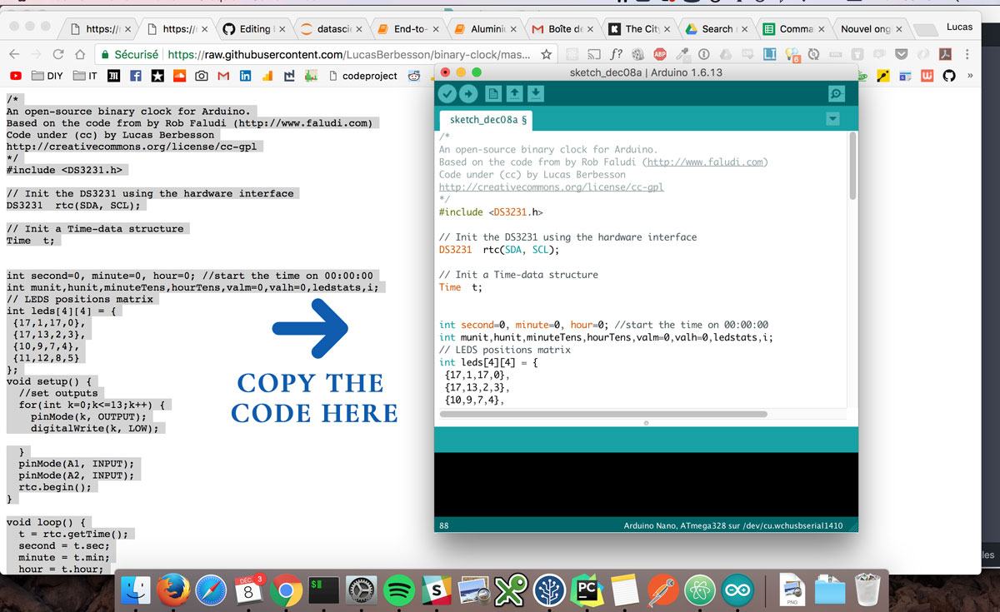
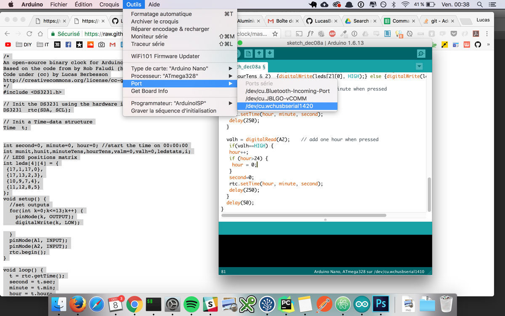
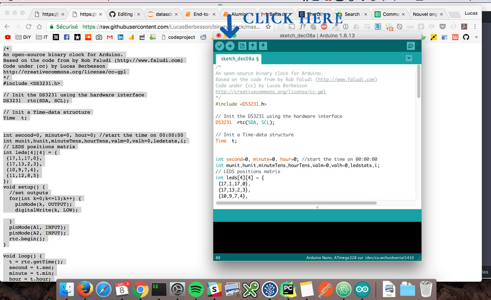

Here are some codes to customize your [The City Clock](http://www.the-city-clock.com/).  

# Available codes

- [click here](https://raw.githubusercontent.com/LucasBerbesson/binary-clock/master/binary_clock/binary_clock.ino) to get the original version of the code. 

- [click here](https://raw.githubusercontent.com/LucasBerbesson/binary-clock/master/binary_clock_night_dimmed/binary_clock_night_dimmed.ino) to get a custom version that will only display the hour column during the night (to lower luminosity)

- [click here](https://raw.githubusercontent.com/LucasBerbesson/binary-clock/master/binary_clock_night_off/binary_clock_night_off2.ino) to get a custom version that will shut down the clock between midnight and 8 am

- [click here](https://raw.githubusercontent.com/LucasBerbesson/binary-clock/master/binary_clock_am_pm/binary_clock_am_pm.ino) to get an AM/PM version of the clock

# How to change the code of the City Clock 
 
 Steps to follow to change the code of the clock : 
 
Download the [Arduino software](https://www.arduino.cc/en/Main/Software)  
Choose one of the available code above  
Copy/Paste the code in a new file inside the Arduino software. (first remove everything in the new file, then copy/paste the entire new code)  

Connect the Arduino of the clock to your computer with the USB cable (no need to remove the Arduino from the clock)  
Make sure to select the right board in the menu (normally it should be automatic but sometimes it does not work). 
The type of board should be "Arduino Nano" and the port something like usbserialXXXX

Hit the => button in the toolbar of the editor to transfer the code  

Wait for your code to upload  
Your clock is ready, you can plug it back somewhere else !
